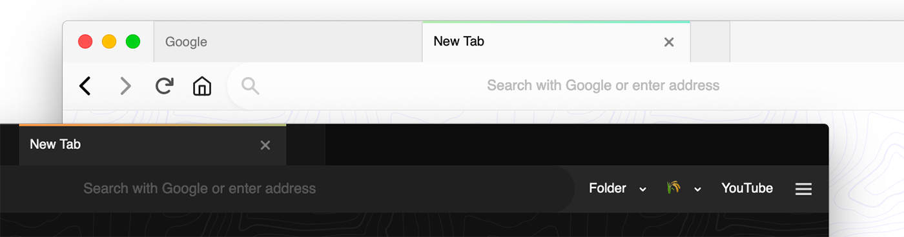
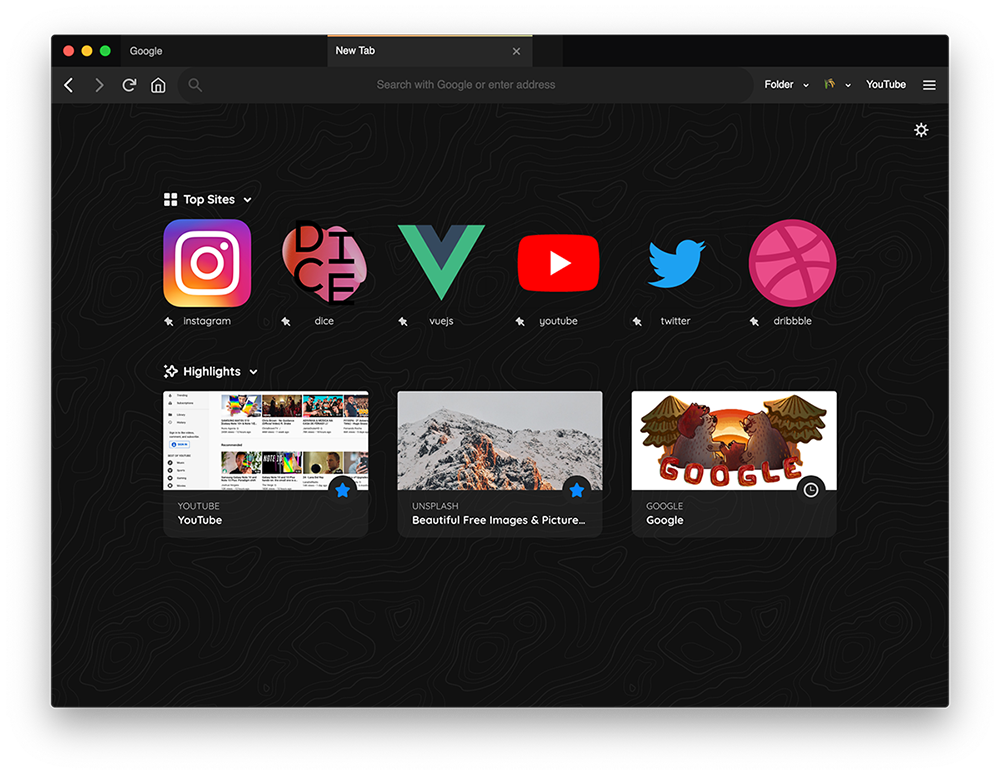

# Firefox 2022 Theme
A fresh firefox browser look.

## How to install

**1) Enable userChrome.css**

  1. Go to **about:config** in the Firefox address bar.
  2. Search for `toolkit.legacyUserProfileCustomizations.stylesheets` using the search at the top.
  3. Toggle the preference to **True**. Now Firefox supports the CSS files, if it's False it ignores them.
  
  
**2) Create chrome folder**

  1. Go to **about:profiles** in the Firefox address bar.
  2. Click the button "Show in Finder" (Mac) or "Open Folder" (Windows) in your that's in the Root Directory
  3. Create a folder named "chrome" or paste the folder and paste the files there.

