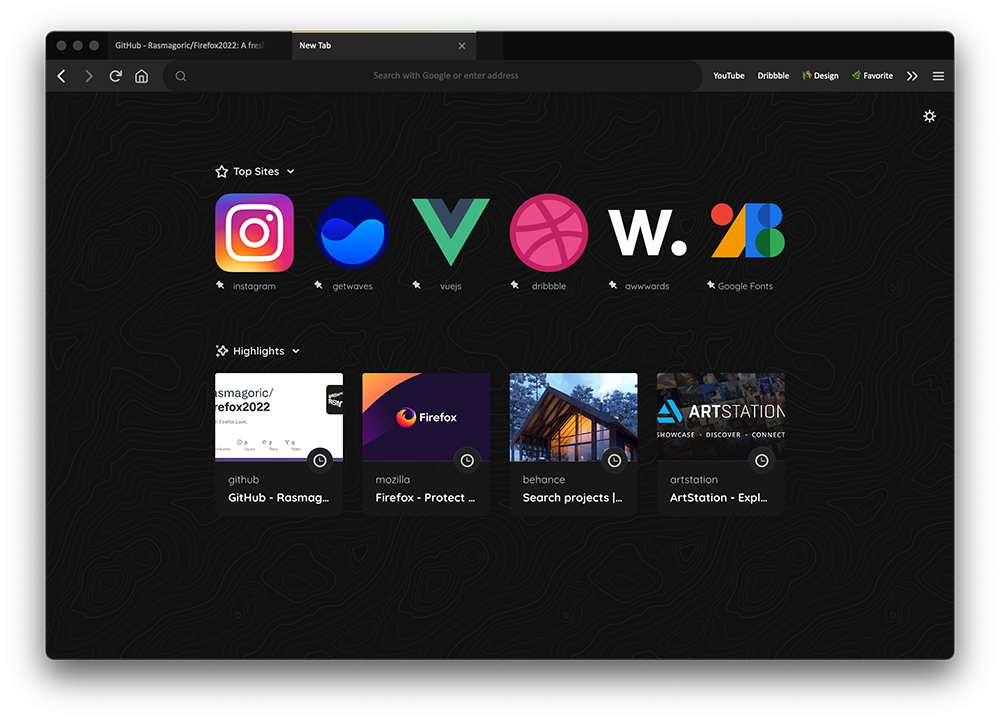

# Firefox 2022 Theme
A fresh firefox browser look. 

## How to install

**1) Enable custom stylesheets**

- Type `about:config` in the address bar.
- Search for `toolkit.legacyUserProfileCustomizations.stylesheets` and toggle the preference to **true**  
  
**2) Create chrome folder**

- Type `about:profiles` in the address bar.
- Look for the button **Show in Finder** (Mac) or **Open Folder** (Windows) in Root Directory.
- Create a folder named "chrome" or paste it all together with the **userchrome.css** and **usercontent.css** files.
- Restart Firefox.

## If you want to make it look better:

- Install the free [Quicksand font from google fonts](https://fonts.google.com/specimen/Quicksand). (Currently in use in the new tab page)
- Set `layout.css.backdrop-filter.enabled` to **true** in the `about:config` to enable blur effects.

