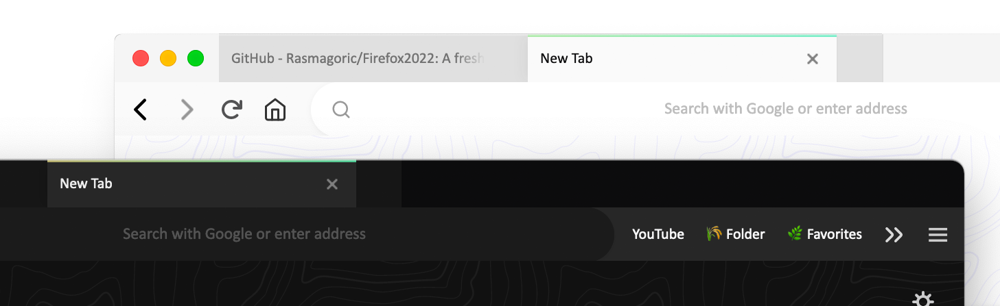
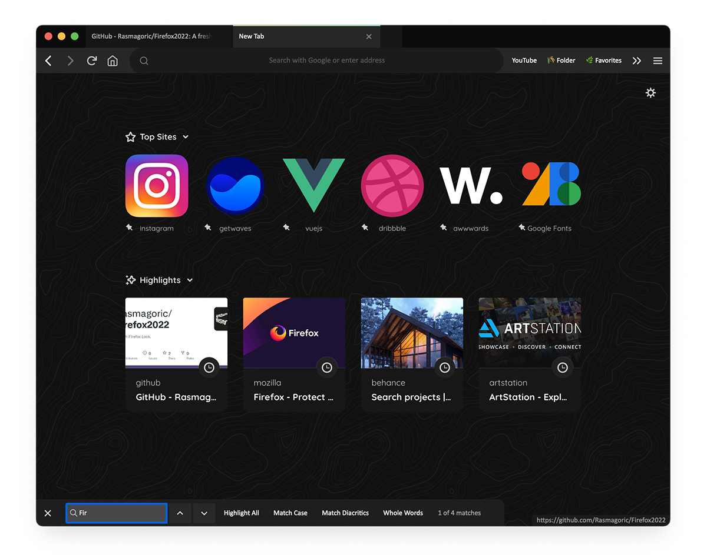

# Firefox 2022
A visual css redesign for your Firefox desktop browser.

✔️ Tested in Mac & Windows10, FF 88.0.1 (Proton update coming soon)\
✔️ More animated elements ✔️ Light / Dark mode ✔️ Better findpage ctrl + F

## How to install

**1) Enable custom stylesheets**

- Type `about:config` in the address bar.
- Search for `toolkit.legacyUserProfileCustomizations.stylesheets` and toggle the preference to `true`  
  
**2) Create chrome folder**

- Type `about:profiles` in the address bar.
- Look for the button **Show in Finder** (Mac) or **Open Folder** (Windows) in Root Directory.
- Create a folder named "chrome" (if it's not there) and paste the `userchrome.css` and `usercontent.css` files inside the chrome folder.
- Restart Firefox. ✔️

(Recommended)
- Set `layout.css.backdrop-filter.enabled` to **true** in the `about:config` to enable blur effects.

